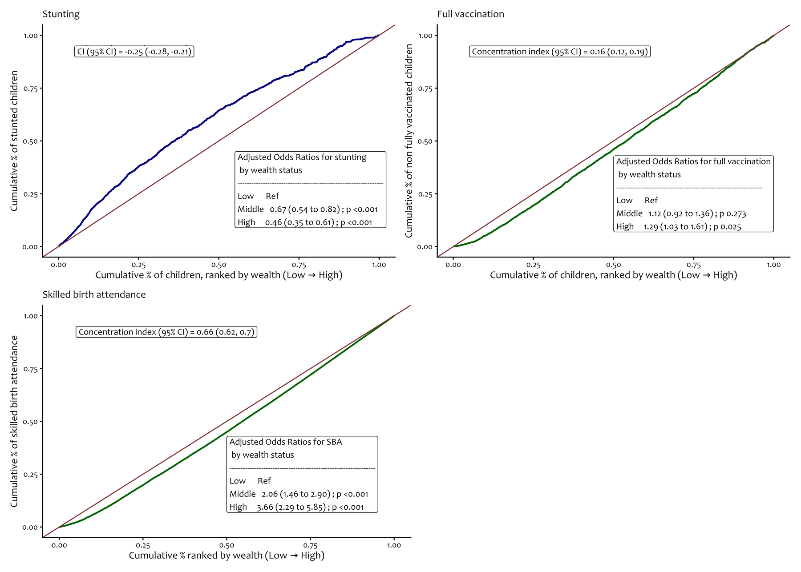
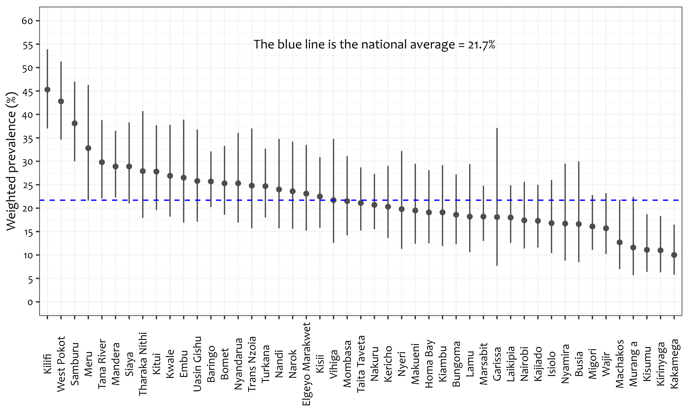
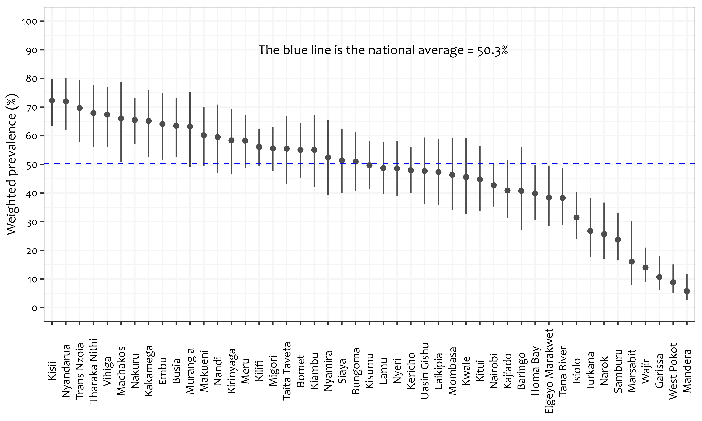
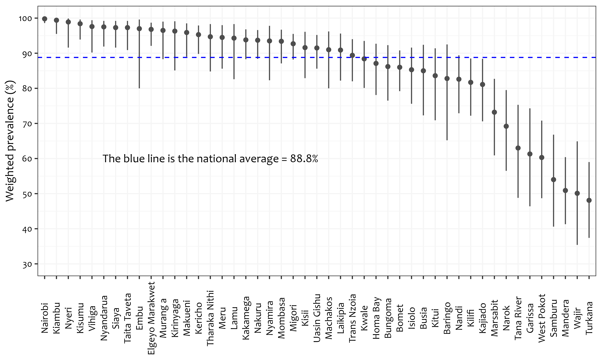
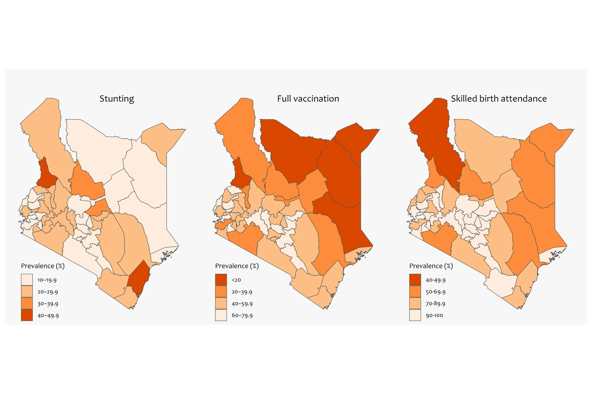
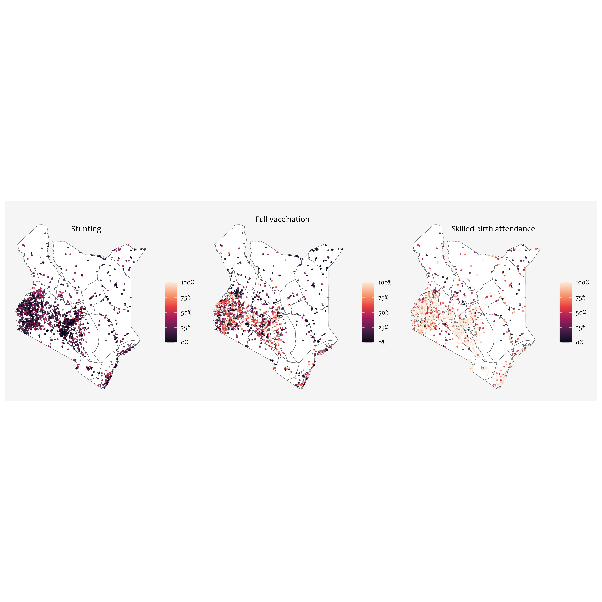
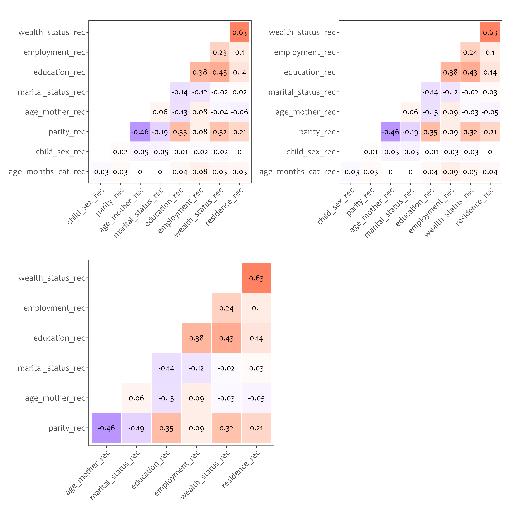
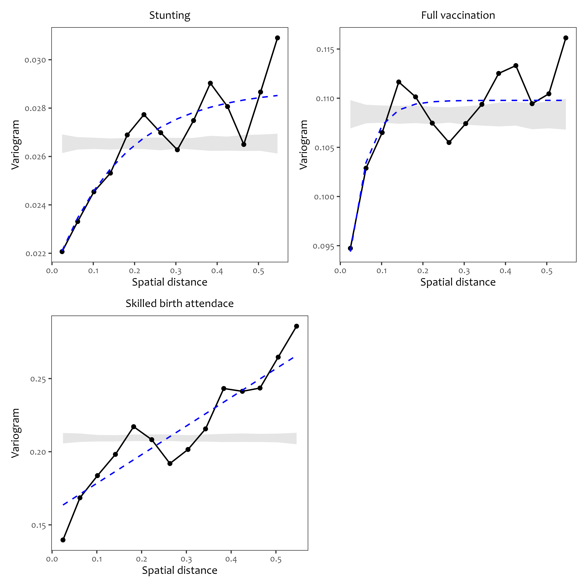
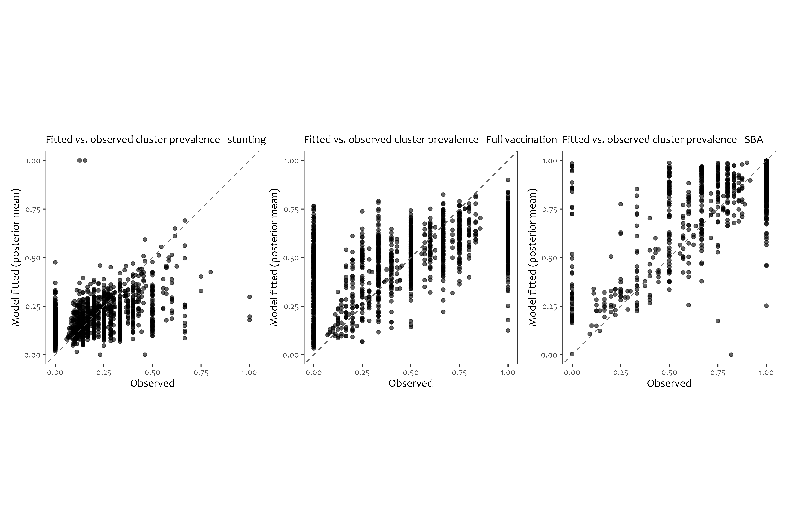
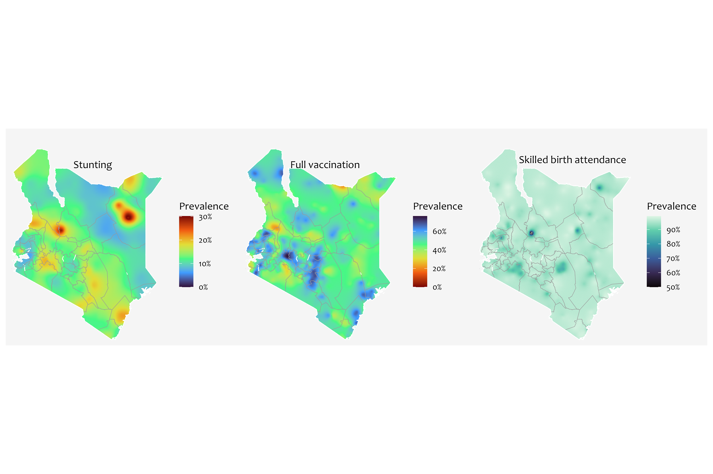

```{r setup, include=FALSE}
knitr::opts_chunk$set(echo = FALSE, warning = FALSE, message = FALSE, dpi = 180, fig.width = 5, fig.height = 3)

```

------------------------------------------------------------------------

# Background

-   Maternal and child health (MCH) remains a global priority


-   Identifying regions with disproportionate burden and key predictors of MCH indicators is key in informing resources prioritisation
  

------------------------------------------------------------------------

# Our indicators are SDG-based

-   **Stunting** 

    -   End all forms of malnutrition by 2030 (SDG 2.2.1)
    
    -   Serves as a vital metric for long-term chronic undernutrition, which irreversibly impairs physical and cognitive development
    

. . .
    
    
-   **Vaccination**

    -   Providing affordable essential medicines and vaccines alongside advancing universal health coverage (SDG 3.b.1)
    
    -   Safeguards infant health by establishing community-level immunity against preventable infectious diseases
    
    
. . .

    
-   **Skilled birth attendance**

    -   Reduce the global maternal mortality ratio to less than 70 per 100,000 live births (SDG 3.1.2)
    
    -    Preventing intrapartum complications


------------------------------------------------------------------------

# Tasks

1.    Does stunting, skilled birth attendance, and immunisation vary by wealth and region?

2.    Where do we target interventions?


------------------------------------------------------------------------

# Approach

**Data**

-   KDHS 2022 child (KR) data 

. . .


**Population**

-   Youngest living child aged 12-35 months (unweighted n = 6022)

. . .


**Models**

-   DHS design adjusted national and subnational prevalences (95% CI)

-   Concentration indices and concentration curves - Disparities by wealth status

-   Model based geostatistics - Mapping risk in unobserved areas


------------------------------------------------------------------------

# Definitions

**Stunting**

-   Height for age z-score 2 SD below the WHO reference population median

. . .


**Skilled birth attendance**


. . .


**Immunisation**


------------------------------------------------------------------------

# Inequality in the distribution of indicators by wealth status

```{r, echo=FALSE, out.width="80%", fig.align="center"}



```


------------------------------------------------------------------------

# Distribution of stunting by subnational regions

```{r, echo=FALSE, out.width="70%", fig.align="center"}



```


------------------------------------------------------------------------

# Distribution of full vaccination by subnational regions

```{r, echo=FALSE, out.width="70%", fig.align="center"}



```

------------------------------------------------------------------------

# Distribution of sba by subnational regions

```{r, echo=FALSE, out.width="70%", fig.align="center"}



```

------------------------------------------------------------------------


# Regional clustering?


```{r, echo=FALSE, out.width="100%", fig.align="center"}



```

------------------------------------------------------------------------

# Sampled locations and observed prevalences


```{r, echo=FALSE, out.width="100%", fig.align="center"}



```


------------------------------------------------------------------------

# MBG Model Specification

**Likelihood:**
$$y_i \mid p_i \sim \text{Binomial}(n_i, p_i), \quad i = 1, \dots, N$$

**Linear predictor:**
$$\text{logit}(p_i) = \beta_0 + \mathbf{X}_i^\top \boldsymbol{\beta} + Z(s_i) + \epsilon_i$$

\vspace{0.3cm}

::: {.block title="Where"}
\small
- $y_i$, $n_i$: number of cases and individuals sampled at cluster $i$
- $\mathbf{X}_i^\top \boldsymbol{\beta}$: fixed effects (covariates)
- $Z(s_i)$: spatial random effect 
- $\epsilon_i$: unstructured random noise (nugget)
:::


------------------------------------------------------------------------

# Preliminary checks

*Multicollinearity*


```{r, echo=FALSE, out.width="60%", fig.align="center"}




```

------------------------------------------------------------------------

# Preliminary checks

*Variograms*

```{r, echo=FALSE, out.width="60%", fig.align="center"}



```

------------------------------------------------------------------------

# Model diagnostics


```{r, echo=FALSE, out.width="100%", fig.align="center"}



```


------------------------------------------------------------------------

# Predicted probabilities


```{r, echo=FALSE, out.width="100%", fig.align="center"}




```


