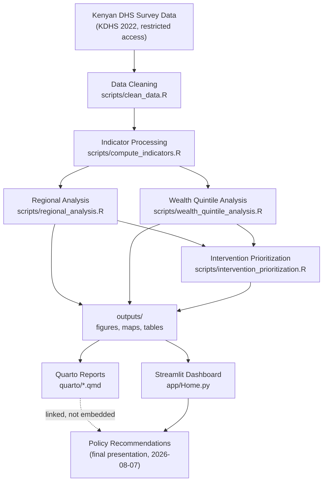

# Project 7 — Where Kenya's Child Health Gaps Are, and Where to Act First

**Regional & wealth-quintile disparities in Kenyan maternal & child health,
turned into a ranked, evidence-based case for intervention.**

Part of the [Eneza Data Science Residential Training 2026](../README.md)
([full brief](../Project_7.md)). Development window: 2026-07-27 – 2026-08-05.
Final presentation: 2026-08-07.

## Problem statement

Kenya's national health survey already tells us where children are worst
off — the gap is turning that survey into something a decision-maker can
act on. This project does two things:

1. **Task 2 — Regional & wealth-quintile indicators.** How does child
   stunting (and, as the remaining analysis lands, immunisation and skilled
   birth attendance) vary across Kenya's 47 counties and across household
   wealth quintiles?
2. **Task 4 — Intervention targeting.** Given that variation, which
   counties should be prioritized first, and on what evidence?

## Why this matters for Kenya

Maternal and child health is a national priority, and resources for
nutrition and health programming are finite. A national average hides where
the problem actually concentrates — this project makes county- and
wealth-level disparities visible and explicit, and turns the worst gaps into
a ranked, defensible starting point for where to intervene first, rather
than leaving that judgment to intuition.

## At a glance

| | |
|---|---|
| **Data** | KDHS 2022 (Kenya Demographic and Health Survey), Kids' Recode — 13,528 children, 1,689 clusters, all 47 counties |
| **National stunting / immunisation / SBA** | 21.7% / 50.3% / 88.8% (survey-weighted, children 12–35 months) |
| **County range (stunting, v1/6–59mo band)** | 9.0% (Murang'a) to 38.6% (Kilifi) — a 29.6-point spread a national average alone would hide |
| **Priority counties (v1, stunting)** | 5 of 47 flagged at ≥ national + 1 SD: **Kilifi, West Pokot, Samburu, Meru, Bomet** |
| **Priority counties (v2, multi-indicator)** | Top 3 by vulnerability index: **West Pokot, Mandera, Samburu** |
| **Wealth equity** | SBA concentration index **+0.66** (wealthy-concentrated) — the largest of 3 indicators. See Wealth Analysis. |
| **Reproduce** | `make all` (see Reproducibility) |
| **Live app** | `streamlit run app/Home.py` |

## Objectives

1. Quantify how Kenyan child-health indicators vary by **region** (county)
   and by **household wealth quintile**.
2. Turn that variation into a **ranked, transparent case for where
   intervention should go first**, with the uncertainty of each estimate
   made explicit rather than hidden behind a point estimate.

## Data sources

| Source | Used for | Access |
|---|---|---|
| [KDHS 2022](https://dhsprogram.com), Kids' Recode (`KEKR8BFL.DTA`) | Task 2, Task 4 | Restricted — approved DHS Program data request required; never committed to this repo |
| [rKenyaCensus](https://github.com/Shelmith-Kariuki/rKenyaCensus) county shapefiles | County choropleth map | Public R package |

## Methodology

**Task 2 (regional & wealth indicators):** KDHS 2022 analyzed as a two-stage
cluster survey (`survey::svydesign()`, PSU = `v021`, strata = `v022`,
weights = `v005`), restricted to the youngest living child per household per
DHS convention. Stunting = HAZ < -2 SD (WHO 2006). County and wealth-quintile
estimates use `svyby()`/`svyciprop()` for correct design-based 95%
confidence intervals — not naive proportions. Full detail:
[`docs/methodology.md`](docs/methodology.md).

**Task 4 (intervention prioritization):** a county is flagged priority if
its stunting prevalence is at or above national prevalence + 1 population
standard deviation across counties — meaningfully worse than typical
variation, not just above average. Built on Task 2's most complete
indicator (stunting, full county coverage) so Task 4 has real output without
waiting on the remaining Task 2 exports; a wealth-quintile equity note is
folded in automatically once that data lands. Full derivation:
[`quarto/intervention_analysis.qmd`](quarto/intervention_analysis.qmd).

## Workflow



Raw KDHS data touches only the R pipeline (`scripts/`), which writes small,
aggregate, non-identifying outputs to `data/processed/` and `outputs/`. Both
the Quarto reports and the Streamlit app read only those committed outputs —
neither re-derives an analysis the R scripts already own, so there's one
source of truth for every number shown in either place.

## Project structure

```
project7-maternal-child-health/
├── app/                          # Streamlit presentation layer
│   ├── Home.py                   # landing page: headline metrics, task status
│   ├── pages/
│   │   ├── 0_Problem_Statement.py       # problem statement, SDG links, objectives, Task 2/4 deliverables status
│   │   ├── 1_Data.py                    # sources, access terms, live data-completeness check
│   │   ├── 2_Methodology.py             # docs/methodology.md in-app + INLA/MBG model specification
│   │   ├── 3_Wealth_Analysis.py
│   │   ├── 4_Regional_Analysis.py
│   │   ├── 5_Spatial_Bayesian_Analysis.py  # observed prevalence, diagnostics, predicted-probability maps
│   │   ├── 6_Intervention_Prioritization.py  # v1 (stunting) + v2 (multi-indicator) rankings
│   │   ├── 7_Policy_Recommendations.py
│   │   ├── 8_Downloads.py               # every committed output file, downloadable
│   │   └── 9_About.py
│   ├── utils.py                  # shared data loaders -- one source of truth for file paths
│   └── requirements.txt          # colocated with Home.py -- Streamlit Cloud looks here, not the project root
│
├── data/
│   ├── raw/                      # gitignored -- restricted KDHS file + individual-level intermediates
│   ├── processed/                # committed -- small, aggregate, non-identifying outputs
│   └── external/                 # reserved for supporting context data (e.g. facility layers), if pursued
│
├── quarto/                       # narrative analytical reports (read data/processed/, don't recompute it)
│   ├── regional_analysis.qmd
│   ├── wealth_analysis.qmd
│   ├── intervention_analysis.qmd
│   └── _quarto.yml
│
├── scripts/                      # the only code that touches restricted KDHS data
│   ├── clean_data.R
│   ├── compute_indicators.R
│   ├── regional_analysis.R
│   ├── wealth_quintile_analysis.R
│   ├── intervention_prioritization.R   # needs no restricted data -- reads data/processed/ only
│   └── export_streamlit_assets.R
│
├── outputs/
│   ├── figures/                  # HAZ histogram, etc.
│   ├── tables/                   # presentation-ready rendered tables
│   ├── maps/                     # county choropleth
│   └── report/                   # gitignored -- rendered Quarto HTML/PDF
│
├── docs/
│   ├── methodology.md
│   ├── data_dictionary.md
│   ├── presentation_notes.md
│   └── ethics_data_protection.md
│
├── PLAN.md
├── README.md
├── environment.yml                # one-command conda env: Python + R + Quarto
├── Makefile                       # `make all` / `make report` / `make app`
└── .gitignore
```

## Reproducibility

Requires Python 3.12, R 4.3+, and Quarto (see `environment.yml` for a
one-command setup):

```bash
conda env create -f environment.yml
conda activate project7-maternal-health
Rscript -e 'remotes::install_github("Shelmith-Kariuki/rKenyaCensus")'  # not on conda-forge

export KDHS_PATH=/path/to/your/KEKR8BFL.DTA   # requires an approved DHS Program data request
make all      # data -> indicators -> regional + wealth -> intervention -> assets -> report
```

`make all` runs the full pipeline end-to-end: cleans the restricted
microdata, computes indicators, produces every file listed in
[`docs/data_dictionary.md`](docs/data_dictionary.md), and renders the Quarto
reports. No committed model or restricted data file is required to explore
the **app** — it reads only the small, already-committed aggregate files in
`data/processed/` and `outputs/`.

### Individual pipeline stages

```bash
make data           # clean_data.R          -> data/raw/kdhs_clean.rds (gitignored)
make indicators      # compute_indicators.R  -> data/raw/kdhs_indicators.rds (gitignored)
make regional         # regional_analysis.R   -> data/processed/task2_*, outputs/figures/, outputs/maps/
make wealth            # wealth_quintile_analysis.R -> data/processed/task2_wealth_quintile.csv
make intervention        # intervention_prioritization.R -> data/processed/task4_* (no restricted data needed)
make assets                # export_streamlit_assets.R -> outputs/tables/, validates app-required files exist
make report                  # quarto render quarto/ -> outputs/report/ (gitignored; attach as a release asset)
```

### Streamlit usage

```bash
pip install -r app/requirements.txt
streamlit run app/Home.py
```

Streamlit auto-discovers `app/pages/*.py` as navigation from `app/Home.py`.
No restricted data or R installation is needed to run the app itself.

**Deploy (Streamlit Community Cloud):** point the deploy at this branch
(`task2-4-submission`), main file path `project7-maternal-child-health/app/Home.py`.
`app/requirements.txt` is colocated with the entrypoint so Cloud's build
picks it up automatically.

`.python-version` (pinned to `3.12`) is committed in **three** places —
the actual repository root, `project7-maternal-child-health/`, and
`app/` — deliberately redundant because Cloud's `uv` build tool resolved
`app/requirements.txt`'s location differently than expected after that
file moved into `app/`, and silently fell back to the newest available
Python (3.14) instead of the pin. On an interpreter that new, `pandas==2.2.3`
has no prebuilt wheel and gets compiled from source, which is what makes a
cold start look like it's hanging rather than just taking the normal
minute or so. If a future restructure moves `app/requirements.txt` again,
move `app/.python-version` along with it.

### Quarto usage

```bash
quarto render quarto/                    # renders all three reports to outputs/report/
quarto preview quarto/regional_analysis.qmd   # live preview while editing
```

Reports read only `data/processed/` and `outputs/` — render them any time
after `make regional` / `make wealth` / `make intervention`, without needing
KDHS access yourself if someone else already ran the R pipeline.

## Status

See [`PLAN.md`](PLAN.md) for the full deliverables checklist and output
contract, and [`docs/task2_audit_report.md`](docs/task2_audit_report.md)
for a full requirement-by-requirement audit against the deployed app's
Problem Statement page. Summary:

| Item | Status |
|---|---|
| National stunting, immunisation, SBA (12–35 months) | ✅ Done — 21.7% / 50.3% / 88.8% |
| County-level stunting, immunisation, SBA (forest plots + maps) | ✅ Done |
| Task 4 v1 (county prioritization from stunting) | ✅ Done |
| Task 4 v2 (multi-indicator vulnerability ranking) | ✅ Done |
| Task 4 owners | ✅ Assigned — John Andrew, Kevinson Mwangi, Elphas Abok |
| Wealth-equity concentration indices (stunting, immunisation, SBA) | ✅ Done |
| Wealth-category (Low/Middle/High) breakdown, all 3 indicators | ✅ Done |
| Small-area estimation (MBG + INLA), all 3 indicators | ✅ Done — observed prevalence, diagnostics, predicted-probability maps |
| Discrete 5-quintile wealth breakdown | ❌ Not produced (3-category breakdown available instead) |

## Key findings

- National stunting: **21.7%**, full immunisation: **50.3%**, skilled birth
  attendance: **88.8%** (KDHS 2022, children 12–35 months, survey-weighted).
- County prevalence ranges from **9.0% (Murang'a) to 38.6% (Kilifi)** on the
  v1 stunting ranking (6–59 month band) — a 29.6-point spread that a single
  national figure completely hides.
- **5 counties (Kilifi, West Pokot, Samburu, Meru, Bomet)** sit at or above
  national prevalence + 1 standard deviation across counties on the v1
  stunting-only ranking — a meaningfully worse-than-typical gap, not just
  above average. The v2 multi-indicator vulnerability ranking's top 3
  (**West Pokot, Mandera, Samburu**) corroborates two of these once
  immunisation and SBA are folded in.
- Some flagged counties carry wider confidence intervals than others (see
  `data/processed/task4_priority_counties.csv`, `ci_width_pct`) — estimate
  certainty varies county to county and should weigh into resourcing
  decisions, not just the point estimate.
- **Skilled birth attendance is the sharpest wealth-equity gap** found
  (concentration index +0.66, 95% CI 0.62–0.70) — heavily concentrated
  among wealthier households. Full immunisation (+0.16) concentrates among
  wealthier households too, in the same direction but a much smaller gap
  than SBA's; stunting (−0.25) is the one indicator that runs the other
  way, concentrated among poorer households. See
  [`data/processed/task2_wealth_concentration_indices.json`](data/processed/task2_wealth_concentration_indices.json)
  for full provenance.
- An independent county-level analysis (12–35 month age band) ranks
  **Kilifi, West Pokot, and Samburu** as the top 3 highest-stunting
  counties — the same top 3 as this branch's own 6–59-month analysis.
  Corroboration across two different age-band choices, not a coincidence.

## Intervention recommendations

1. **Prioritize Kilifi, West Pokot, Samburu, Meru, and Bomet** for the next
   round of nutrition programming, weighting resourcing by both the size of
   the gap vs. national prevalence and the certainty of each estimate.
   Independent corroboration from a second, differently-scoped analysis
   (see Key findings) strengthens the case for at least the top 3.
2. **Treat skilled birth attendance as a wealth-access problem, not only a
   geographic one.** Its concentration index (+0.66) is the largest
   wealth-related gap found in this analysis — larger than stunting's or
   immunisation's — so an SBA intervention aimed only at low-coverage
   counties may miss the bigger driver: cost/access barriers correlated
   with household wealth within a county, not just which county a mother
   lives in.
3. **Confirm the discrete wealth-quintile breakdown before finalizing
   resourcing.** The concentration indices above establish *that* wealth
   inequality exists and roughly how large it is; a quintile table is still
   needed to say *which* quintiles specifically to target.
4. **Re-run the prioritization once immunisation and skilled-birth-
   attendance county-level data land.** A county that ranks moderately on
   stunting alone but poorly across all three indicators is a stronger case
   than any single indicator suggests.

Full derivation and caveats: [`quarto/intervention_analysis.qmd`](quarto/intervention_analysis.qmd),
[`docs/methodology.md`](docs/methodology.md).

## Future work

- Wealth-quintile, immunisation, and skilled-birth-attendance exports
  (in progress — see Status).
- Fold multiple indicators into a single county-level composite score for
  Task 4 v2, once all three Task 2 indicators are available.
- Stretch goals from the original project brief, not attempted this round:
  a multidimensional deprivation index, comparison across DHS survey waves,
  small-area estimation below the county level.

## Team

| Task | Owners |
|---|---|
| Task 2 — Regional & wealth-quintile indicators | Kevinson Mwangi, Elphas Abok |
| Task 4 — Intervention targeting | John Andrew, Kevinson Mwangi, Elphas Abok |

Per the brief's requirement, every member should be able to explain the
whole submission, not only their own task.

## Ethics & Data Protection

See [`docs/ethics_data_protection.md`](docs/ethics_data_protection.md) —
covers KDHS microdata handling, Kenya Data Protection Act 2019 applicability
for future work, and responsible use of the intervention ranking.

## License

MIT — see `LICENSE`.
