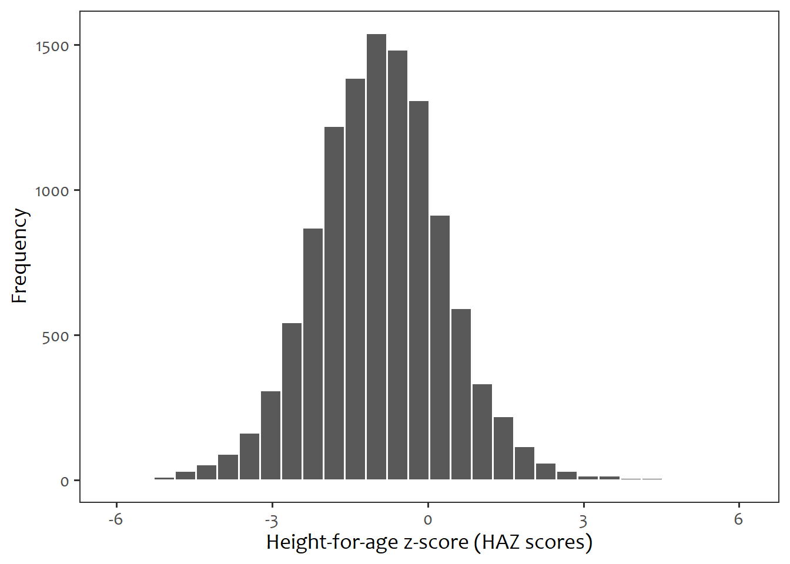
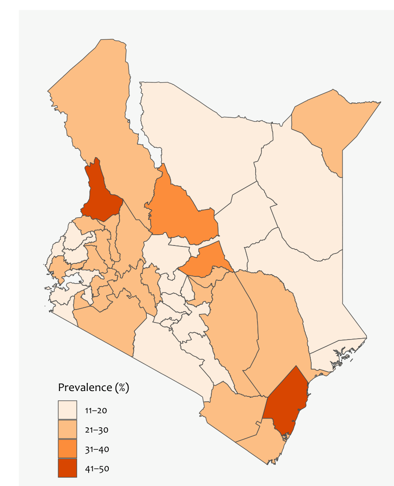

<!--
This report reads the already-computed, aggregate, non-identifying outputs
in ../data/processed/ and ../outputs/ -- it does NOT touch restricted KDHS
microdata directly, so it renders for anyone with a clone of this repo,
no DHS data access required.

The computation itself lives in scripts/regional_analysis.R (run via
`make regional`), which is the only place that touches restricted data.
This keeps one source of truth for the numbers and lets this report focus
on narrative and methodology, not recomputation.
-->

```{r}
#| label: setup
#| message: false
#| warning: false
#| include: false

pacman::p_load(tidyverse, jsonlite, gt)
summary <- fromJSON("../data/processed/task2_stunting_summary.json")
county <- read_csv("../data/processed/task2_stunting_by_county.csv", show_col_types = FALSE)
```

## Data and sample

This analysis uses the **Kenya Demographic and Health Survey (KDHS) 2022**,
Kids' Recode file — a nationally representative, two-stage cluster sample.
The dataset is restricted-access; obtained via an approved data request to
[The DHS Program](https://dhsprogram.com) and never committed to this
repository (see `scripts/clean_data.R` for the access and cleaning step).

The analysis keeps the youngest living child per mother per household, per
DHS convention, giving `r format(summary$sample$total_children_all_ages, big.mark=",")`
children across `r format(summary$sample$total_clusters, big.mark=",")`
survey clusters spanning all 47 counties.

## Stunting: definition and national estimate

Stunting is defined as height-for-age z-score (HAZ) < -2 SD against the WHO
2006 growth reference standards, among children aged 6–59 months
(n = `r format(summary$sample$stunting_analysis_n_6_59_months, big.mark=",")`).
Estimates are survey-weighted and account for KDHS's two-stage cluster design
(primary sampling unit = `v021`, strata = `v022`, weight = `v005`) — a naive
unweighted proportion would misrepresent the population.

::: {.callout-note}
**National weighted stunting prevalence: `r summary$national$stunting_prevalence_weighted_pct`%**
:::

```{r}
#| label: fig-haz-histogram
#| echo: false
#| fig-cap: "Distribution of height-for-age z-scores, children 6-59 months. The WHO stunting cutoff (HAZ < -2) is the boundary between the shaded and unshaded regions of this distribution."

```

## Where stunting is worst: county-level estimates

County estimates use `svyby()` with `svyciprop()` for design-based 95%
confidence intervals — a plain county-level average would understate the
uncertainty in counties with fewer sampled clusters.

```{r}
#| label: fig-county-map
#| echo: false
#| fig-cap: "Weighted stunting prevalence by county."
if (file.exists("../outputs/maps/county_stunting_map.png")) {
  
} else {
  cat("Map not yet generated -- run `make regional` (scripts/regional_analysis.R).")
}
```

```{r}
#| label: tbl-county
#| echo: false
county |>
  arrange(desc(prevalence_pct)) |>
  gt() |>
  cols_label(
    county = "County", prevalence_pct = "Prevalence (%)",
    ci_lower = "95% CI lower", ci_upper = "95% CI upper"
  ) |>
  tab_header(title = "Stunting prevalence by county, ranked highest to lowest")
```

The highest-prevalence counties feed directly into Task 4's intervention
prioritization (`quarto/intervention_analysis.qmd`) — see that report for the
targeting logic and its policy implications.

## What this report does not yet cover

Two of Task 2's three required indicators are not yet analysed:
immunisation coverage and skilled birth attendance (code skeletons exist in
`scripts/compute_indicators.R`, gated on restricted-data access). Wealth-
quintile breakdowns — the second axis Task 2 is defined against — are
tracked separately in `quarto/wealth_analysis.qmd`; see that report's status
note for current coverage.
